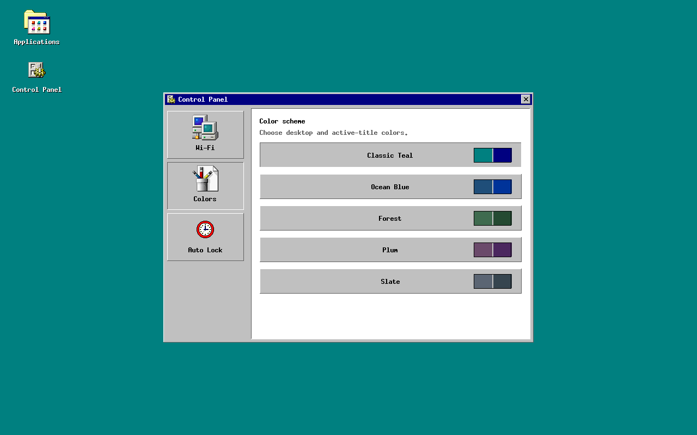
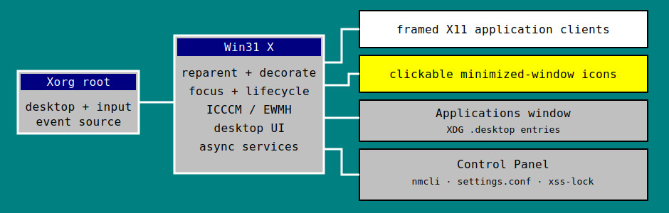

# Win31 X

Win31 X is a small X11 window manager styled after the useful parts of Windows
3.1. It is written in C against core Xlib and is intended to run as the sole
window manager in a Debian Xorg session.

The current implementation includes:

- Windows 3.1-inspired beveled frames, title bars, move/resize, click-to-focus
  and raise, close, minimize, and maximize/restore controls. Dragging a title
  bar to the left or right screen edge snaps the window to that half of the
  desktop. Transient dialogs stay above their owning application.
- A real desktop icon for every minimized client. One click maps, raises, and
  focuses that application again.
- A permanent **Applications** desktop icon. It opens a keyboard- and
  mouse-driven window containing the visible applications installed through
  freedesktop `.desktop` entries. Applications and Control Panel are persistent
  windows: they can coexist, remain open when focus moves or a program starts,
  maximize or snap like application windows, and close explicitly with their
  `X` button or Alt+F4.
- A permanent **Control Panel** desktop icon with three sections:
  **Wi-Fi** scans, connects, and disconnects through NetworkManager;
  **Colors** applies and remembers one of five desktop/title-bar schemes; and
  **Auto Lock** enables an idle timeout or locks the screen immediately through
  `xss-lock` and `xsecurelock`, with one visible asterisk for each password
  character entered.
- High-resolution application artwork selected from the user-supplied Windows
  98 icon archive. Terminals, clocks, editors, calculators, file managers,
  browsers, media tools, settings, networking, displays, clocks, games, and
  other common categories receive the corresponding supplied icon; unknown
  programs use its supplied executable icon.
- ICCCM client lifecycle, focus, `WM_DELETE_WINDOW`, `WM_TAKE_FOCUS`,
  `WM_CHANGE_STATE`, and `WM_STATE` handling.
- A deliberately small EWMH subset for client lists, activation, close
  requests, frame extents, one desktop, work area, and hidden state.
- Alt+Tab, Alt+F2, and Alt+F4 shortcuts.



## Build on Debian

Install the build packages and compile:

```sh
sudo apt update
sudo apt install build-essential pkg-config libx11-dev libpng-dev
make prefix=/usr
make prefix=/usr check
```

The Makefile verifies `pkg-config`, X11, and libpng before compiling and prints
the required Debian/Ubuntu packages if anything is missing. You can run only
that preflight with `make check-build-deps`.

For every Control Panel feature, install the recommended runtime services too:

```sh
sudo apt install network-manager xss-lock xsecurelock
```

The binary is `build/win31x`. Win31 X does not need a compositor, GTK, Qt, or
an existing desktop environment. Its supplied-color icon renderer requires the
normal TrueColor visual provided by contemporary Xorg configurations.

To install the binary and make it available in a display manager's session
list:

```sh
sudo make prefix=/usr install
```

Log out, choose **Win31 X** in LightDM/GDM/SDDM, and log back in. Do not start it
inside a session that already has a window manager unless you use a nested X
server.

## Try it without replacing your desktop

On Debian, install a nested X server and a couple of test programs:

```sh
sudo apt install xserver-xephyr xterm x11-apps
Xephyr :2 -screen 1024x768 &
DISPLAY=:2 ./build/win31x &
DISPLAY=:2 xterm &
DISPLAY=:2 xclock &
```

The desktop starts with Classic Teal unless another saved scheme exists. Click
**Applications** once, then double-click a program to start it. Minimize a
program with the underscore button; its icon appears along the bottom of the
desktop and restores it with one click. Click **Control Panel** once to manage
Wi-Fi, colors, and screen locking. Applications and Control Panel remain open
when you focus another window or start a program, and they can be open at the
same time; close either one with its `X` button or Alt+F4.

Controls:

| Action | Control |
| --- | --- |
| Move / resize | Drag a title bar / outer frame edge |
| Snap left / right | Drag a title bar to the left / right screen edge |
| Minimize / maximize or restore / close | `_` / maximize-restore / `X` title-bar button |
| Restore minimized app | Click its desktop icon |
| Applications | Click its desktop icon or press Alt+F2 |
| Control Panel | Click its desktop icon |
| Launcher navigation | Arrows, Page Up/Down, Enter, mouse wheel |
| Wi-Fi | Refresh, select a network, enter its password if required, then Connect |
| Change colors | Select Colors, then click a color scheme |
| Auto lock | Select Auto Lock, toggle it, choose a timeout, or click Lock Now |
| Cycle / close active window | Alt+Tab / Alt+F4 |

## Tests

`make check` tests `.desktop` parsing, safe `Exec` argument expansion, settings
validation and private atomic persistence, NetworkManager output and command
handling, auto-lock process supervision, all supplied PNG dimensions and
decoding, exact supplied-asset checksums, and every icon category. The core
tests do not require X; the auto-lock test exercises X saver policy as well when
a display is available. For the X11 regression suite, install `libxtst-dev`,
`xvfb`, `xauth`, and `xfonts-base`; `make smoke-xvfb` then uses real XTEST
pointer input to exercise the actual window-manager state machine:

- manage a new client and reach `NormalState`;
- adopt a client that was mapped before the window manager started;
- focus and raise overlapping clients, including one with its own conflicting
  passive button grab, while replaying the activating click to that client;
- reject stale focus events from an already minimized client;
- keep transient dialogs above their owners and minimize/restore the family
  through one desktop icon;
- honor client Above/Below stack requests without breaking transient order;
- maximize and restore a client without losing its previous geometry, and snap
  title-bar drags to the left and right halves of the screen;
- enforce minimum sizes even with pathological resize increments;
- validate default, centered, southeast, static, and dynamically changed
  window gravity, bordered synthetic geometry, and shift-free withdrawal;
- map unmanaged top-level InputOnly windows and maintain oldest-first
  `_NET_CLIENT_LIST` ordering;
- minimize through `WM_CHANGE_STATE`, find the mapped desktop icon, and restore
  by clicking;
- open the Applications window and actually launch a test desktop entry while
  keeping the launcher open;
- keep Applications and Control Panel mapped together across focus changes and
  newly mapped clients, ignore Escape, and close only the selected internal
  window through its `X` button;
- change and persist a color scheme, scan and connect to a simulated secured
  Wi-Fi network, and invoke Lock Now;
- verify that both idle and Lock Now locker processes receive asterisk password
  feedback without changing the window manager's environment;
- verify that Wi-Fi passwords are masked, passed outside the process argument
  list, and absent from window-manager logs;
- activate and raise a newly mapped client without dismissing Applications or
  Control Panel;
- withdraw and correctly unmanage a client; and
- reject a second window manager on the same display.

Run the memory-sanitized build with:

```sh
make clean
make SANITIZE=1 check all
```

## QEMU test VM on Apple Silicon

The scripts in `tools/qemu` create a project-local Debian 13 ARM64 VM. ARM64 is
important on an Apple Silicon Mac because it uses QEMU's HVF acceleration;
an x86_64 guest would use much slower CPU emulation.

```sh
./tools/qemu/prepare-debian-vm.sh
./tools/qemu/run-debian-vm.sh
```

Preparation downloads Debian's generic-cloud ARM64 image, pins and revalidates
its published checksum on later runs, checks the qcow2 images, creates a
disposable overlay, and packages the current source tree into a fresh NoCloud
seed. During provisioning Debian installs Xorg and the build tools, builds the
real `.deb` (including the Xvfb/XTEST suite), installs it, reruns the suite
against `/usr/bin/win31x` and its installed icon directory, checks the
`x-window-manager` alternative and X session entry, and starts LightDM. The
Cocoa display then logs into Win31 X automatically. The VM account is `win31x`
with password `win31x`; SSH is exposed only on host loopback port 2222.

Generated VM data lives in `.vm/` and is ignored by Git. Delete that directory
to get a completely fresh guest.

## Design notes and current scope



Win31 X is a focused single-screen, single-workspace window manager. It skips
override-redirect menus and tooltips, preserves clients through the X save set,
and never sends `.desktop` `Exec` text through a shell. The launcher tokenizes
commands and expands the field codes that make sense when no files or URLs were
supplied.

The Control Panel also avoids a shell. Wi-Fi operations use exact `nmcli`
argument vectors and deliver a WPA/SAE password through a private inherited
file descriptor; the password is never placed in `argv`, an environment
variable, or a log message, and transient copies are cleared. Auto Lock uses
the established X saver/`xss-lock` path so suspend and login-session locking
remain compatible with Debian instead of implementing password authentication
inside the window manager. Win31 X launches its owned lock paths with
`XSECURELOCK_PASSWORD_PROMPT=asterisks`: this confirms each received character
but intentionally reveals password length. Authentication remains entirely in
`xsecurelock` and PAM; Win31 X never handles the lock-screen password. Color and
auto-lock preferences are stored privately in
`$XDG_CONFIG_HOME/win31x/settings.conf` (normally
`~/.config/win31x/settings.conf`).

Reliable core-X click replay uses a transparent input child over inactive
client content. Consequently, an inactive application's hover cursor and
pointer-motion feedback begin after its first activating click; the click
itself is still delivered to the application.

The shipped icon pixels come only from the user-provided `win98_icons.zip`.
Their exact archive paths, chosen resolutions, checksums, and licensing caveat
are recorded in [`assets/icons/README.md`](assets/icons/README.md); Win31 X does
not draw a replacement application icon when those assets are unavailable.

This first version provides maximize/restore and left/right screen-edge snap,
but intentionally does not implement virtual desktops, general-purpose tiling
or layout automation, compositing, multi-monitor placement, a taskbar,
file-manager desktop items, or restoration of client windows across login
sessions. Those can be layered on without changing the core minimized-icon
model.
